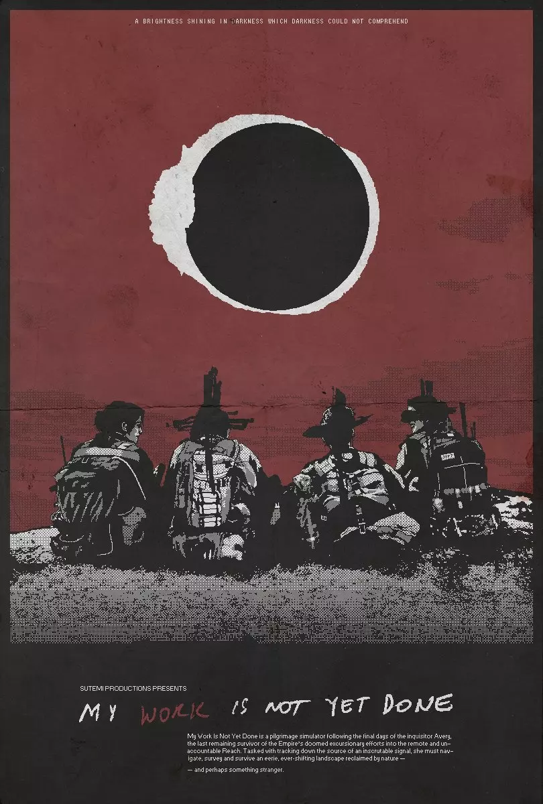

# *My Work Is Not Yet Done*

**CURRENT STATUS: In development** 

## Overview

* **Developer(s):** Sutemi Productions
* **Publisher(s):** TBA
* **Release Date:** TBA
* **Platform(s):** Windows
* **Genre(s):** Exploration, survival, simulation, horror
* **Engine:** GameMaker Studio 2
* **Source code:** Will be made public shortly after release
* **Links:** [itch.io](https://spncryn.itch.io/work), [Steam](https://store.steampowered.com/app/1207690/My_Work_Is_Not_Yet_Done/), GitHub (TBA)
* **Development log:** [Kickstarter](https://www.kickstarter.com/projects/spncryn/my-work-is-not-yet-done/updates)
* **Price:** $20 USD (Steam), Pay what you can (itch.io)

## What is this game?

_My Work Is Not Yet Done_ is a narrative-driven investigative horror game, combining elements of the survival/simulation genres with a dense, nonlinear plot exploring the imbrication and dissolution of human identities/meanings within uncanny wilderness.

_Work_ follows the final days of the inquisitor Avery, the last remaining survivor of a doomed excursionary mission into a remote and unaccountable stretch of old country. Tasked with tracking down the source of an inscrutable signal, she must navigate, survey and survive an eerie, ever-shifting landscape reclaimed by nature — and perhaps something stranger.

It is part of an ongoing series of works within a larger shared universe dedicated to examining questions of theological and cosmic horror: issues such as faith, weakness, devotion and loneliness — and the concomitant suffering contingent to such experiences.

## What are some things you can do in this game?

* Attempt to uncover the source of a strange and inscrutable radio transmission
* Perform unreasonably-detailed diagnostics and repairs upon a number of faithfully-reproduced environmental sensors and meters
* Contemplate lovely two-tone black-and-white wilderness
* Encounter unspeakable, claustrophobic dread and horror in your pursuit of the transcendental
* Trace the progress of water in mL through your digestive and excretory systems
* Read through many, many pages of personal journal entries and speculate about the author's psychic state
* Experience an authentic reproduction of what it feels like to defecate in the absence of flushing toilets and toilet paper
* Ignore your mission and spend your final days processing worms into nutrient powder

## How does this game work?

The gameplay of *My Work Is Not Yet Done* revolves around the interplay between  two core pillars: *investigative/interpretive work*, and *survival work*.

*Investigative/interpretive work* lies at the heart of Avery’s mission, which involves (at  the simplest level, at least) the identification and sourcing of a strange transmission  from within the area. 

Half of this work takes place on Avery’s end, and is driven through monitoring and  maintaining a network of various sensors, meters, and instruments distributed  throughout the area of operations, which help her detect and respond to potential  anomalies.  

The other half takes place on the player’s end, and is document-driven. This part of  the game involves sifting through a considerable amount of in-game documentation,  including private journals, records, and other such found documents, in an attempt to  discern the most viable “truth” behind both Avery’s mission and the signal itself. The  player will be expected to work through a large volume of information and draw out their own interpretations and conclusions.

> I’ve long been interested in the idea of the ergodic narrative, whose namesake is  etymologically derived from a Greek portmanteau roughly meaning something like,  “laborious path”. In practice, ergodic literature mostly consists of narratives whose  methods of traversal – which is to say, how they’re read, and how meaning is  derived – are nontrivial compared to more traditional forms like straight reading left to-right. 
> 
> In terms of games, ergodicity can be reasonably expanded to include any designs  which accommodate modes of reading – or in this case, playing – whose primary  methods of meaning-making intentionally invoke varieties of player participation  beyond the framework or scope of traditional embedded experiences (plot,  mechanics, “lore”, etc). A lot of games that attempt this unfortunately fall into the trap  of confusing empty obfuscation for interpretive richness, and inevitably end up  getting “lost in the sauce” (in a manner of speaking) of their own thesis-less  ambiguity. 
> 
> My goal with this project is to attempt an alternate approach, which is to reject  ambiguous minimalism and instead, embrace the textured maximalism of our lived  reality, in which we constantly find ourselves with too much information and too little  time. I wish to inspire focused critical inquiry rather than presumptive speculation and  loose reading, and encourage players to accept the necessary incompleteness of all  knowledge, and interpretation: and, hell, if the game is successful enough, maybe  even begin to work together to develop amongst and with one another a greater  shared knowledge and awareness that embraces heterodoxy and the breadth of  individual experience.

*Survival work* provides the moment-to-moment framework in which all of the above  takes place, and occurs primarily at the level of material bodies: hunger, thirst,  fatigue, nausea, discomfort. The player is tasked with keeping Avery alive and  functional, long enough at least to finish her work properly; as well as maintaining the  various equipment in the region to ensure their continued functionality. 

All of this occurs at a certain distance between the subjects (Avery, the machines)  and the observer (the player): there are no meters or countdowns to rely on, no  precise measure of any particular mechanism or failure. The player is left to rely on  signs and signals – Avery’s thoughts, the way she talks about certain things, test  results, signal pingbacks and mechanical reports – in order to attempt to discern  various needs and deficits.

> One of my bigger frustrations with the implementation and design of similarly-minded  elements in a lot of games is that they often seem to have little functional purpose or  thesis behind their inclusion, aside from fitting a genre expectation. Consequently, I  thought long and hard about what function such mechanics would serve in my game  as well, if any at all. As development progressed and my attention shifted more and  more towards the narrative elements of the game, I struggled to reconcile this  change of spirit with the more obviously “game”-y legacy of the survival gameplay. Ultimately, though, I came to realise that actually, the seemingly incompatible  distinction between the two was not only not so mutually exclusive as I’d originally  thought, but in fact, deeply, almost inextricably interlinked. 
> 
> All of us, no matter the scale or nature of our ambitions, are inevitably constrained by  the various quirks and demands of our bodies. The spirit is indistinct from the flesh,  and philosophy little more than an escape from or justification for the aches in our  muscles. The mechanisms of our existence – eating, drinking, sleeping, passing  waste, wasting time – are not just necessary frictions of, or a complementary texture  to our existence, then; but the very foundation of them. They’re there not in spite of  what else we may do or dream of or accomplish, but as the fundamental underlying  mechanism beneath the rest of it. These awkward bodies, that hiss, and wheeze,  and ooze, and tremble, and leak, are the very same ones that dream of things like  beauty and transcendence and greatness and love and meaning.  
> 
> And on that note: the thing about a whole lot of works that attempt to grapple and  reckon with encounters of transcendence is that they end up getting so caught up in  the cataphatic allure of the transcendent, that they allow the human to slip away.  There’s a beauty to that, to be certain – but I know now this is not that kind of work:  not the spirit that rises, but the body that remains. 

## Are there any games to which this might be comparable? 

* Her Story 
* The Long Dark
* Welcome to the Game II 
* A Hand With Many Fingers 
* The Longing 
* Neurocracy

## What are you attempting to accomplish with this project?

### For me

My immediate goals with this project are:

* To provide a unique and innovative take on the survival genre, focusing on reproducing the moment-to-moment experience of being enmeshed within an alien wilderness on a psychological and physical level, and the necessary boredom and psychic friction of a bodied experience of finding oneself lost and disoriented.
* To explore new ways of imagining the possibilities of the survival genre beyond the traditional understanding of “survival” as a purely physiological phenomenon; and centering the psychic, rather than physical experience as the core of the game experience.
* To explore the construction of narrative as a deliberately ambiguous and historiographical process, by involving the player directly within the process of interpretation and “lore”/meaning-making through the intentional exploitation of the divide between authorial, player, and diegetic knowledges. 
* To interrogate embedded assumptions about authorial, player, and character agency, particularly in terms of user interfaces and mechanical  frameworks; and challenge these assumptions in ways that may productively subvert player expectations, and encourage novel insights into the relationships between these three perspectives. 

### For audiences

My high-level goal with this project is to create a work that would allow me the opportunity and space to experiment with, and iterate upon several fairly common assumptions about topics such as:

* What are we really talking about when we talk about the “uniqueness” of “interactivity” for games as a medium?
* What does “good” game design actually mean, in both theory and practice?
* Can “good” game design productively target and cultivate unpleasant sensations?
* What is a “bad” game? 
* What do we mean by a game’s “difficulty”?
* What is the difference between accessibility, and difficulty?
* Is the mechanical experience of a game necessarily a distinct aspect from the narrative experience?
* Can games effectively portray seemingly antithetical experiences such as boredom, tedium, disorientation, and frustration without conceding the apparent advantage of their medium?
* Is it more important to respect a player’s time, or their intelligence? Does there need to be a delineation between the two?
* How does one effectively “market” — if at all — a work that demands a certain level of non-trivial participation, and deliberately seeks on some level to antagonise its audience’s sensibilities?

This is, of course, a rather limited selection from the list of questions I’ve been considering since the beginning of development, but I think they represent a pretty decent sampling regardless of the most salient issues I aim to address with this project. 

### For my peers

From the beginning of development, I have been keeping detailed logs of virtually all my development-related activity, which cover everything from what I work on (or don’t...) on a day-to-day basis, to substantial notes outlining my evolving thoughts on various design decisions and philosophies over the course of the process. I decided to record these as a means of both assuring my own integrity in the process, as well as being able to leave behind a meticulous record of development which can, regardless of the project’s eventual success (or lack thereof), be salvaged as a public asset for other prospective developers in the future. 

Ultimately, beyond the ways in which this project may serve my personal ends, I intend for it to be released in as much of its entirety as possible as a public resource, as a detailed case study covering a dimension of game development that has seen little coverage, despite considerable interest. I have taken considerable care throughout the process of documentation to remind potential audiences that, regardless of the eventual reception of the project, it is not through my exact footsteps that I hope to serve as an example, but instead, through my commitment to a certain kind of honesty and transparency, both in the things that go well, and the things that don’t — and everything in between.

## Media

*All listed media can be assumed to be up-to-date as of the last recorded edit on this document.*

* **TRAILER:** ["APOSTASIS"](https://www.youtube.com/watch?v=KmwlUFxTwc0). *YouTube*.
* ["Locations"](https://www.youtube.com/watch?v=8kaqgBTiRSU). _YouTube_.
* Static images and assets available via [Google Drive](https://drive.google.com/drive/folders/188LiT7CEaLm4HelTEBM7MwxXn35tj_lD?usp=sharing).

## Additional Links

* [Postmortem for Kickstarter campaign](https://www.kickstarter.com/projects/spncryn/my-work-is-not-yet-done/posts/2737778). *Kickstarter*.
* [Case study of "APOSTASIS" trailer](https://www.kickstarter.com/projects/spncryn/my-work-is-not-yet-done/posts/2725083). *Kickstarter*.
* ["How a would-be priest explores the horror of God in videogames"](https://www.rockpapershotgun.com/2020/03/20/how-a-would-be-priest-explores-the-horror-of-god-in-videogames). *Rock Paper Shotgun*.
* Full transcript for Rock Paper Shotgun interview. *[Medium](https://link.medium.com/rQQaxlKjj5)* or *[Google Docs](https://docs.google.com/document/d/1G53IPAKgMzM2ZA8-K6hxRX2dk73WVJMpnBlCWG1lIx4)*.
* ["How game designers handle the burden of encumbrance
"](https://www.gamedeveloper.com/design/how-game-designers-handle-the-burden-of-encumbrance). _Game Developer_.
* [Games Are Reimagining Nature in the Age of Climate Catastrophe](https://www.fanbyte.com/features/games-are-reimagining-nature-in-the-age-of-climate-catastrophe/). _Fanbyte_.

## Technology

*My Work Is Not Yet Done* is produced in GameMaker Studio 2. Its development is being documented using the [MDMA](https://www.gamesasresearch.com/mdma) framework by Pippin Barr, Rilla Khaled and Jonathan Lessard. 

## Licence

*My Work Is Not Yet Done* is currently planned to be released under a [Creative Commons Attribution 4.0 International (CC BY 4.0)
](https://creativecommons.org/licenses/by/4.0/) licensed. 

## About

Sutemi Productions is an American video game developer based in the New York metropolitan area. It derives its name from *sutemi waza*, a term in various Japanese martial arts that can be roughly translated as “arts of abandonment”: a series of techniques requiring the user to “abandon”, or sacrifice some part of their stance in order to create or exploit an opening in the opponent. The fundamental philosophy underlying all of the works produced under Sutemi Productions is that only through directly confronting, without insincerity or resentment, our deepest flaws and vulnerabilities can we begin to produce works that are honest to the best versions of what they – and we – can be.

## Contact

* **Inquiries:** [spenceryan123@gmail.com](mailto:spenceryan123@gmail.com)
* **Twitter:** [@spncryn](https://twitter.com/spncryn)

---

*Disclaimer: The information contained within this entry is accurate and relevant up to the date of the last recorded edit: 18 December 2021.*

